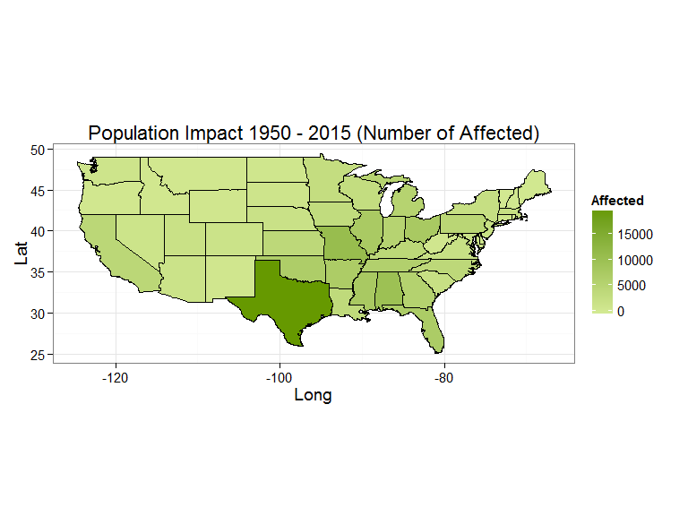

# Weather Shiny App - Pitch Presentation
nhatmn  
Wednesday, June 17, 2015  

## **Weather Shiny Introduction**
https://nhatmn.shinyapps.io/ShinyWeatherApp

There are some simmilar Shiny apps on Internet currently. But they are just talk about database from 1950 to 2011 and mostly out-of-date data.
In this app, I improve one of those app:

+ Update database to June 2015 by combine the dataset of [Coursera Reproducible Research Course](https://d396qusza40orc.cloudfront.net/repdata%2Fdata%2FStormData.csv.bz2) (1950 - 2011) with the latest dataset from NOAA
+ Improve the UI to be looking better, modify and implement some new functions about maps colors, text controlling, and also error handling (the maps currently just supports 50 states of US, but the dataset contains more states, such as: "American Samoa", "Virgin Islands", etc.)

### **Application's usage:**
You can adjust the Year range and Event Types using the Control Panel which located on the left side. On the right side, there are 3 tabs:

+ **Weather Explorer By States**: Using Maps to show you the Injuries and/or Fatalities by States.
+ **Weather Explorer By Years**: Using Plots to show you the Injuries and/or Fatalities by States.
+ **Weather Data Viewing**: Show you the data in table. Filtered dataset can be downloaded on this tab.

---

## **About the dataset using on this app**

This application is based on the U.S. National Oceanic and Atmospheric Administration's (NOAA) storm database.

The Database contains:

+ From 1950 to 2011: Dataset has been obtained from [Coursera Reproducible Research Course](https://d396qusza40orc.cloudfront.net/repdata%2Fdata%2FStormData.csv.bz2) and processed as a part of peer assignment for the course.
+ From 2012 to June 01, 2015: Dataset from http://www.ncdc.noaa.gov/stormevents/ftp.jsp

Full description of the processing workflow is available on [GitHub](https://github.com/nhatmn/NOAA_Weather_Data_1950-2015.git). Please check out and follow **Merge_to_2015.R** to reproduce the cleaning algorithm.

Source code of this app is available on the [GitHub](https://github.com/nhatmn/Weather_Data_Explorer_App.git).

----

## **Damage of Weather Events by States**


```r
# Read the Weather dataset after aggregating
weatherData <- fread('data/StormData_to2015_after_aggregating.csv') %>% 
  mutate(EVENT_TYPE = tolower(EVENT_TYPE))
weatherData <- data.table(weatherData)
weatherData$STATE_NAME <- tolower(weatherData$STATE_NAME)
# Remove unsupported states
dt <- weatherData[!weatherData$STATE_NAME %in% c("american samoa", "atlantic north", "atlantic south",
      "district of columbia", "e pacific", "guam", "gulf of alaska", "gulf of mexico", "hawaii waters", 
      "lake erie", "lake huron", "lake michigan", "lake ontario", "lake st clair", "lake superior", 
      "puerto rico", "st lawrence r", "virgin islands"),]
event_types <- sort(unique(dt$EVENT_TYPE))
aggregate_by_state <- function(dt, year_min, year_max, evtypes) {
  replace_na <- function(x) ifelse(is.na(x), 0, x)
  round_2 <- function(x) round(x, 2)
  states <- data.table(STATE_NAME=sort(unique(dt$STATE_NAME)))
  aggregated <- dt %>% filter(YEAR >= year_min, YEAR <= year_max, EVENT_TYPE %in% evtypes) %>%
    group_by(STATE_NAME) %>%
    summarise_each(funs(sum), COUNT:CROPS_DAMAGE)
  left_join(states,  aggregated, by = "STATE_NAME") %>%
    mutate_each(funs(replace_na), FATALITIES:CROPS_DAMAGE) %>%
    mutate_each(funs(round_2), PROPERTY_DAMAGE, CROPS_DAMAGE)    
}
# Get damage of weather events by states
data <- aggregate_by_state(weatherData, 1950, 2015, event_types)
data$Affected <- data$FATALITIES + data$INJURIES
```

## **Population Impact 1950 - 2015 (Number of Affected)**

 

